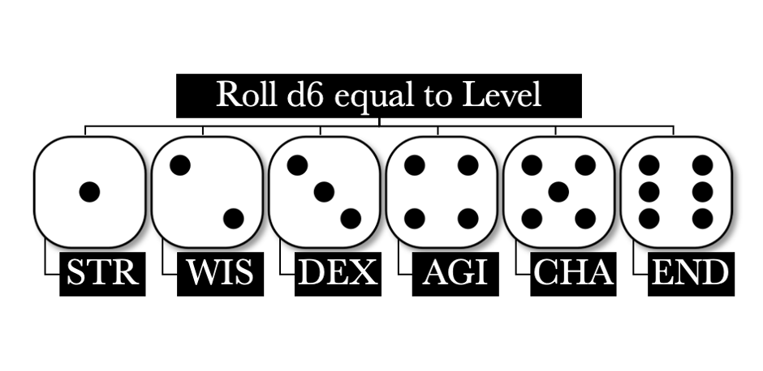
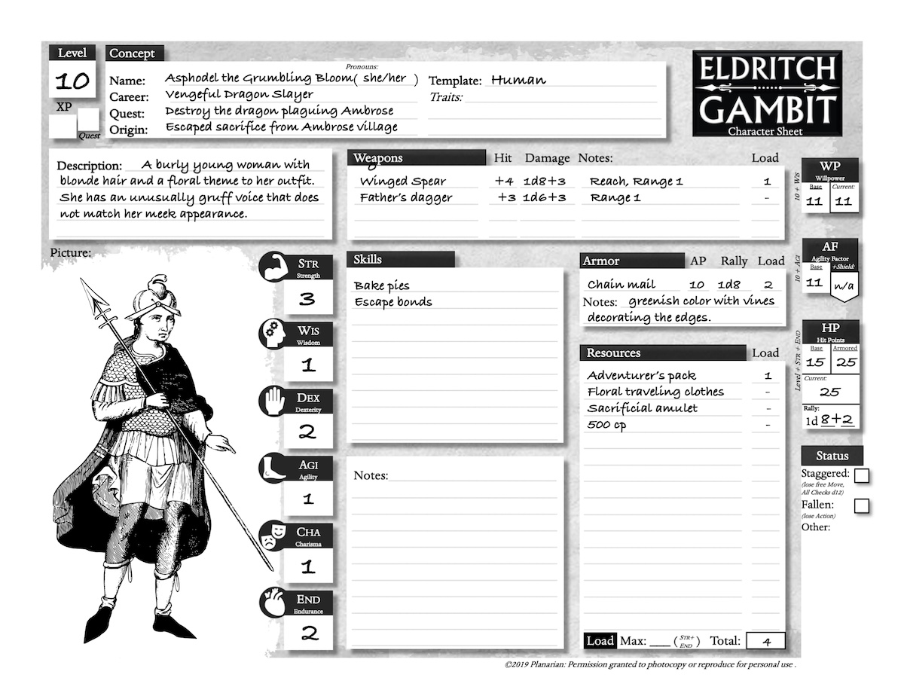
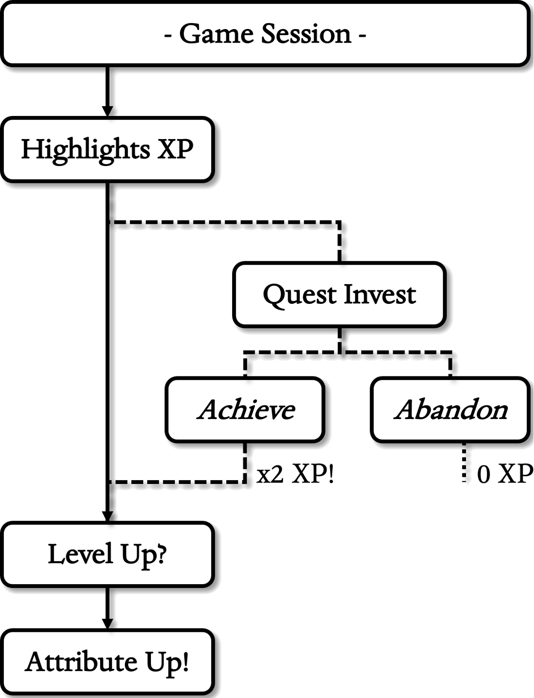

# CHARACTERS
{: .no_toc}

## Table of Contents
{: .no_toc}
- TOC
{:toc}

## Overview

The following is a brief rundown of the steps to create a character in
Eldritch Gambit. You may skip steps or take them in a different order if
you please.

1. **Level :** the overall power and experience of the
character. Most groups start at Level 10.
1. ** :** choose a Name, Career, Quest, Origin,
Template, and Description to give them a place in the game world.
1. **Attributes :** set starting Strength,
Dexterity, Wisdom, Agility, Charisma, and Endurance to give them power
over the game world.
1. **Defenses :** set Willpower, Agility Factor, and
Hit Points to give them their defenses.
1. **Skills :** choose up to 3 specific freeform
talents to round them out and add interest.
1. **Gear :** buy or choose weapons, armor, and other
items to properly equip them.

A player may start even without having chosen all their Concepts,
Attributes, Skills, or Gear. These Details may arise spontaneously as
“development” in the first few games or so.

##  Level

The ***Level*** describes how powerful the character is, with most
groups starting at Level 10. The higher the Level, the more Attribute
points they have in total. The most (“max”) you can put into an
Attribute is half the Level, rounded up. Attributes are explained soon
in this chapter . For now, consider them a way
of showing what your character is best at.

A standard tenth Level character starts out heroic and
advances slowly. This gives them time to focus outwards, flexing their
power and making their mark on the world. Characters add a Level
whenever they earn as many ***XP***  as their
current Level. The player then raises the Level by one and erases the
old XP, keeping any left over. Characters get 1-3 XP when the player
recounts their favorite highlights from the last session or reaps a
Quest reward.

{: .text-center}
**LEVEL BENEFITS**

{: .lh-0}
|     Level    |     Attribute     Points    |     Tier         |
|:------------:|:---------------------------:|:----------------:|
|     1        |     1 (max 1)               |     -            |
|     2        |     2 (max 1)               |     -            |
|     3        |     3 (max 2)               |     -            |
|     4        |     4 (max 2)               |     -            |
|     5        |     5 (max 3)               |     Common       |
|     6        |     6 (max 3)               |     -            |
|     7        |     7 (max 4)               |     -            |
|     8        |     8 (max 4)               |     -            |
|     9        |     9 (max 5)               |     -            |
|     10       |     10 (max 5)              |     Heroic       |
|     11       |     11 (max 6)              |     -            |
|     12       |     12 (max 6)              |     -            |
|     13       |     13 (max 7)              |     -            |
|     14       |     14 (max 7)              |     -            |
|     15       |     15 (max 8)              |     Elite        |
|     16       |     16 (max 8)              |     -            |
|     17       |     17 (max 9)              |     -            |
|     18       |     18 (max 9)              |     -            |
|     19       |     19 (max 10)             |     -            |
|     20       |     20 (max 10)             |     Legendary    |

The *Tier* column is just to guide Imps on what sort of stories to
expect. The Imp may start the party at any Level that fits the
adventure.

##  Concept

Next, think about your character’s ***Concept***, the basic ideas you
have about them before getting to their numbered stats. This breaks down
into their ***Name, Career, Quest, Origin, Template,*** and
***Description***. If you are having a tough time choosing these now,
you may choose later - even during the actual game! You will miss out on
their benefits until then, however.

### Name

What does your character go by? This is often a family name, nickname,
or title. There is space for pronouns (he/him, she/her, they/them,
etc.). Make sure their name is easy to pronounce and fits the setting.
If you have trouble, roll 5d6 below, ask the group for ideas, or just
come back to it later.

**Examples:** *Emmet Falco, Tiny Toes, Celestia Alurian, Onion Bob,
Sandalphon, Gruz, etc.*

{: .text-center}
**NAME SEEDS**

{: .lh-0}
| 5d6 | Initial | Examples                |
|:---:|:-------:|-------------------------|
| 5   | U       | Utrid, Uriah, Ulthar…   |
| 6   | Z       | Zack, Zeno, Zelda…      |
| 7   | O       | Oleg, Oliver, Ondine…   |
| 8   | V       | Vonn, Vincent, Vera…    |
| 9   | N       | Nisha, Negan, Nemo…     |
| 10  | W       | Wash, Wei, Will…        |
| 11  | G       | Geralt, Gina, Gort…     |
| 12  | T       | Topaz, Terra, Thane…    |
| 13  | B       | Bina, Bahb, Brutus…     |
| 14  | S       | Selena, Stavros, Simm…  |
| 15  | C       | Cullen, Cora, Cran…     |
| 16  | R       | Reba, Rhett, Ruprekt…   |
| 17  | J       | Jona, Jerm, Jubal…      |
| 18  | M       | Marik, Merina, Mordo…   |
| 19  | D       | Dorf, Deren, Dagnert…   |
| 20  | A       | Alistair, Arok, Ainu…   |
| 21  | L       | Lemuel, Lear, Lana…     |
| 22  | E       | Egon, Eva, Einz…        |
| 23  | K       | Ketch, Kroma, Kavon…    |
| 24  | P       | Pike, Palla, Portia…    |
| 25  | H       | Heff, Hali, Habra…      |
| 26  | F       | Finn, Fianna, Fenty…    |
| 27  | I       | Iggy, Irina, Islington… |
| 28  | Y       | Yg, Yelen, Yakov…       |
| 29  | Q       | Q, Quint, Qera…         |
| 30  | X       | Xul, Xena, Xavier…      |

### Career

What is your character’s primary occupation, talent, or calling? This
reflects their style of intelligence, so Checks related to Career use a
d20 instead of just a d12. Specific Career names are best; vague ones
like “Adventurer” might seem clever at first but rarely end up fitting a
specific action. Adding a flavorful adjective helps make them unique and
can even justify the d20 applying to more actions!

One either has a d20 on related tasks or not. Proficiency beyond that is
a matter of having good Attributes, equipment, resources, contacts,
hirelings, magic, and supporting Skills .

**Examples:** *Skeptical Priest, Smasher of the Old Ways, Humble wizard,
Mercenary Captain, Itinerant Yogurt Salesman, Haughty Courtesan, etc.*

### Quest

What drives your character to adventure? Quests can include anything
from base greed to the search for enlightenment. These should be
meaningful and specific, but achievable within a few sessions. Try to
break grand Quests into smaller steps, which is good for the narrative
as well as feasibility. If you complete a Quest, you get back twice the
XP you invested. See the Advancement section for more details
. Look forward to changing Quests often as the
character grows or faces new situations.

**Examples:** *Revenge on the orc commander for taking my place, Win the
local bar’s ostrich wing-eating competition, Prove loyalty to the
gnomes.*

### Origin

Everyone comes from somewhere, where does your character hail from?
Origins should be strongly linked to the setting and may include
formative events that bring them to this moment. These work like Careers
but grant d20 for local knowledge and speaking their native language.

One-shot games and dungeon-crawls without any reference to the outside
world might never call for this. For more elaborate campaigns, it can be
vital. If your group is using a collaborative setting
, you may be able to make up your own homelands
and do world-building as a Player!

**Examples:** *Eldest daughter of the Argos village chieftain, Raised by
dire wolves, Baker’s boy from Crosston, River City Delinquent, etc.*

###  Template

What sort of creature is your character? Put their species, model,
clade, “race,” etc., here. Eldritch Gambit assumes, perhaps unjustly,
that your setting at least has humans. As such, most need only put
“Human” here, implying no further changes. Other ***Templates*** may
have ***Traits*** describing how they differ from humans, for better or
worse.

Weird things can happen during an adventure. Even a baseline human can
gain Traits from magic or affliction. The Templates section
 has more information, including how to play
non-human, animal, or even monstrous forms as characters.

### Description

What do others see when they meet your character? This is a short
sentence or two including evocative features like physical build, age,
sex, and a distinctive quirk. It helps some players to just pick a few
notable things and write them in the Description area of the character
sheet. A random (d20) table for a distinctive feature is below for
inspiration.

**Examples:** *A sad young woman with impossibly blue skin. A frog
transformed into a human who still ribbits when nervous, a burly old man
with a scar over one eye.*

{: .text-center}
**DESCRIPTION SEEDS**

{: .lh-0}
| D20 | Distinctive Quirk                          |
|:---:|:-------------------------------------------|
| 1   | Ailment (*chronic sneeze, cough…)*         |
| 2   | Atavism (*catlike, mousy, caveman…)*       |
| 3   | Bearing (*twitchy, regal, shifty…)*        |
| 4   | Dress (*Snappy, slovenly, antiquated…)*    |
| 5   | Ears (*pointed, cauliflower, huge…)*       |
| 6   | Eyes (*close-set, piercing, wide, blue…)*  |
| 7   | Face (*pinched, cherubic, floppy…)*        |
| 8   | Fear (*abandonment, ham, bridges…)*        |
| 9   | Gait (*stiff, serpentine, trembling…)*     |
| 10  | Growth *(horn, hump, benign tumor…)*       |
| 11  | Habit (*catchphrase, nervous tic…)*        |
| 12  | Hair (*pompadour, bald, blue…)*            |
| 13  | Hands *extra finger, webbed, huge…)*       |
| 14  | Item (*trinket, lucky hat, handcuffs…)*    |
| 15  | Mouth (*wide, full, toothy grin…)*         |
| 16  | Nose (*broad, flat, long, red...)*         |
| 17  | Physique *(short, tall, skinny, stout...)* |
| 18  | Skin (*birthmarks, scars, acne…)*          |
| 19  | Tattoo (*artistic, tribal, prison…)*       |
| 20  | Voice (*gruff, flat, high-pitched…)*       |

##  Attributes

Each character has six ***Attributes*** to define their strengths and
weaknesses: ***Strength (Str),***
***Wisdom (Wis), Dexterity (Dex), Agility (Agi), Charisma (Cha),*** and ***Endurance (End).*** An average person would have about one
in each. Anything above one is exceptional and more befitting of an
adventurer. You may have a negative Attribute if you wish but get no
points back for it.

A character gets Attribute points or “pluses” to distribute equal to
their Level. Fantasy settings allow for incredibly high Attributes, with
a max of half the character’s Level, rounded up.

{: .text-center}
**ATTRIBUTE DESCRIPTIONS**

{: .lh-0}
| Attribute | Description |
|:---------:|-------------|
| -2        | Abysmal     |
| -1        | Poor        |
| 0         | Low         |
| +1        | Normal      |
| +2        | High        |
| +3        | Very high   |
| +4        | Great       |
| +5        | Optimal     |

It is not unusual for high-level characters to have “superhuman”
Attributes of +6 or more. The Basics  and Scenes
chapters  give examples of how these Attributes can be
used.

You may also roll Attributes randomly. To do this, roll d6 equal to
Level, then put each 1 into Str, each 2
into Wis, each 3 into Dex, each 4 into Agi, each 5 into Cha, and each 6 into End. Your final Attribute score equals the
number of dice in that Attribute. If more than half the dice end up in
one Attribute, flip the excess dice over to their opposite side and put
them in that Attribute instead.

{: .text-center }
**RANDOM ROLL METHOD**

{: .text-center }
**THE ATTRIBUTES**

### Strength (Str)

Brawn
and muscle. Adds weapon damage, boosts Hit Points (HP,
 and helps to carry heavier loads. Used for Rolls
more than Checks. The pride of every mighty warrior.

### Wisdom (Wis)

Cunning
and Fortitude. Aids Checks to create, remember, or discover and forms
the Willpower (WP,  defense. In a world of magic,
the mind is the most powerful weapon.

### Dexterity (Dex)

Finesse
and manual coordination. Aids accuracy of attacks, whether melee, ranged
or spell. Also linked to handsy feats of grasping, stealing, or
catching.

### Agility (Agi)

Reflexes and athletic ability. This forms the Agility Factor (AF,
 and adds to Checks for athletic actions. Get
into or out of trouble faster.

### Charisma (Cha)

Presence,
and persuasion. Adds to Checks for trying to get one’s way in tense
situations and empower Spells. Those who want to become legends will
invest here.

### Endurance (End)

Constitution
and stamina. Resists Afflictions, burdens, and injury, boosts Hit Points
(HP,  and Rallies . Everyone can
use this when the going gets tough.

##  Defenses

Derived from Attributes, these keep track of how far one is from
suffering setbacks like injury, stress, or death. You can find Defenses
on the far-right edge of the character sheet, making them easy to mark
and erase during play.

{: .text-center}
**DEFENSES**

{: .lh-0}
| Defense        | Abbr. | Base                                                                            |
|--------------------------|:-------------:|-------------------------------|
| Agility Factor | “AF”  | 10 + Agi                                         |
| Hit Points     | “HP”  | Level + Str + End |
| Willpower      | “WP”  | 10 + Wis                                         |

### Willpower (WP)

This crucial gauge of mental reserve tracks how well the character is
coping. ***WP*** is equal to ten plus Wis. This serves two purposes, both at odds
with the other! First, it is the character’s DF when foiling stealth or
the mental influence of others. Second, they can spend each point to
Reroll  a die. Ultimately, one must decide when to
boost their character’s effect on the world at the cost of their
resolve.

The use of magic items called Materia also takes its toll on the mind.
Readying a Materia costs a WP, which cannot be regained until the item
is discarded or finds its way into someone else’s hands.

WP can only drop to half before self-preservation and fatigue kicks in.
Luckily, Fellowship  with other characters can restore
it. Starting a new campaign refills it entirely.

Normally, one can only
spend WP on their own Rolls. The exception is that Fallen
 or Dead characters may spend WP on Rolls made
by allies. Attribute this to ghostly intervention, vengeful comrades, or
pure coincidence. It does however give the unfortunate a way to
contribute.

### Agility Factor (AF)

This is how hard it is for an opponent to hit the character, whether due
to lightning reflexes, keen situational awareness, or the lack of
either. A foe must beat this on their Attack Check to successfully hit
them. Shields  add a bonus directly to AF, so the
+*Shield* box is for those wielding one.

###  Hit Points (HP)

A rough measure of how far the character is from doom. These are a murky
combo of stamina, morale, and luck. Being low on HP simply means the
next blow they take may be their last. <u>Base</u> HP is equal to
Level + Str + End, and this may go down from damage and back
up from Rallies .

Armor  adds its Armor Points (AP) to HP, totaled
in the <u>Armored</u> box. The *Current* box tracks damage to HP. The
<u>Rally</u> box is how many HP can be recovered with a Rally Action
. The Rally die also improves with armor.

For example, a Level 10 character with 2 Str and 4 End
gets 16 Base HP. They can Rally for 1d4+4 HP. If they wear leather armor
granting 5 AP, their Armored HP jumps to 21 and their Rally to 1d6+4.

***Damage*** lowers current HP by that amount. A combatant can stand and
fight as long as they have HP left. At zero or below, they are
***Fallen***. Likewise, any hit that drops someone to zero or lower is a
***Felling blow***. Fallen may or may not mean dead, depending on their
later Recovery Check .

If the incoming hit is *not* a Felling blow, Players may choose to
***Stagger***. This negates that damage entirely but inflicts the
***Staggered*** Status. It’s best to do this only in the face of massive
damage or when dangerously close to zero HP. Once Staggered, they cannot
Stagger again until that Status clears.

**HP Status Effects**

- **Staggered** combatants have taken a nasty wound. They lose their Free
Move until Recovery and all Checks are made on a d12 instead of d20.
- **Fallen** combatants have dropped to the ground. They get no Action,
and their AF drops to zero.
- **Dead** means time to make a new character. This happens on a failed
Recovery Check or any doom the Player and Imp feel were not survivable.
Powerful Artifacts  may be able to reverse Death,
depending on the setting.

###  Status

There are other baleful effects one may fall under beyond the usual
Staggered, Fallen, or Dead above. Usually temporary, there is ample room
for these on the blank “Status” section on the right hand side of the
character sheet.

- **Blinded:** Cannot see or do things entirely reliant on sight, such as
reading. Checks partly reliant on sight face a -4 penalty, and foes
count as if behind Soft Cover (-4). Lasts until treated or recovered.
- **Burning:** a burning character takes 1d6 fire damage at the top of
each round. They also cannot Rally , as being on fire is
a real mood-killer. A Use Action narrated as rolling, dousing, etc.
 may extinguish the flames and end this status.
- **Confused:** stunned, baffled, or hallucinating. Checks turning up an
odd (raw) number on the dice fail due to whatever nonsense they are
thinking.
- **Deafened:** cannot hear or perform tasks reliant on hearing, like
commands or music. Sign language or lip-reading OCS may alleviate this.
- **Diseased:** failed a Recovery Check after exposure to an infection
. Can get better or worse with later Recovery Checks.
- **Encumbered:** burdened with a Load over Str +
End. The Encumbered take two Moves to cross a Zone. If Load
exceeds twice Str + End, they are
***Incapacitated***. Dropping Load ends this effect.
- **Grappled:** partly restrained but struggling. Grappled characters lose
their Action until their attacker loses hold of them.
- **Incapacitated:** paralyzed, drugged, or overburdened. They lose their
Action and AF drops to zero. Ends when the Spell, Affliction, or
Encumbrance does.
- **Poisoned:** suffering from a poison Buildup Roll. Record the Buildup
with the Status. If the total exceeds their Base HP, the poison takes
effect.
- **Surprised:** unaware combatants lose their Action for the first
Initiative Round  and halve their AF. This ends
next Round when they recover their wits.

##  Skills

These supplement Career and Origin, broadening the character and adding
flavor. Skills are very flexible and can stand for languages,
privileges, unusual talents, even vices or flaws! Skills are more
specific but not as serious as Careers or Origins, so have fun with
them!

All characters can choose up to three Skills at the start, though they
can gain more later via Training Montages . You may
leave some blank and choose them later. If a character reveals a
suspiciously convenient Skill during play, they should make up a likely
story about why they have it.

Like Careers and Origin, broadly worded Skills may backfire if they are
not a good fit for the task. To prevent this, try to phrase Skills as
“Verb-noun” combos such as “Assess treasure”, “Skin carcasses,” or
“Speak Dwarvish.” If you are playing in a well-defined setting, there
may be thematic Skills ready for you to choose from. This helps ensure
the character fits in and gets to use their talents.

Players may ask others to think up a Skill for them. This can lend an
unexpected aspect to the character’s abilities and invest the Players in
each other’s characters.

**Example Skills:** *Bake bread, Speak Elvish, Advocate for the
Conquering Worm, Sigh Wistfully at Compliments, Track Delinquents, Tend
to Father’s Estate, Scurry up Trees, Enjoy Bad Poetry, etc.*

##  Gear

What one chooses to carry with them can be as revealing of character as
any other aspect. It’s a bit much to deal with right out of the gate, so
starting characters have the option of choosing from the list below to
make things quick.

Make sure you have any gear you need to do things related to your Career,
Origin, and Skills. The Player may spend coins on other gear, and the
Imp may grant more or less if it fits the character and setting. The
Resources chapter  has more info.

Magic-users and the well-prepared may want to buy Ephemera
 like potions and scrolls. These expendable items are
about 100 cp each and allow limited spell casting. Some Imps allow
characters to start with Materia, and even an Artifact is not out of the
question if it makes for a good game.

**Starting Gear**

-   One normal weapon of your choice .
-   One normal armor of your choice .
-   A tool or item needed for your Career.
-   Memento or trinket reflecting your Origin.
-   Traveling clothes in your style.
-   Backpack (bedroll, small cup, 10m rope, flint & steel, chalk, snacks
    counting as one ration, a torch, large sack, water skin or canteen).
-   Dagger or Knife (same stats).
-   500 (or 2d4x100) copper pieces (“cp”).

###  Encumbrance

An adventurer can only carry so much, especially returning from a
lucrative outing. Each significant burden counts as one or more units of
***Load***. This is based on how many hands it would take for an average
person to carry the item. One can bear up to Str + End in
Load before becoming ***Encumbered***. This means it now takes two Moves
 to cross a single Zone. If carrying more than twice
Str + End,
they are ***Incapacitated*** instead.

This scales with Size, so what would be held in one hand for a
human-sized character may not even count for a giant, and vice-versa.

- **Load 0** items can usually fit into a pocket or small purse. A single
hand could hold several or many. For example, a dagger or herb packet.
- **Load 1** items are anything an average person can easily carry in one
hand; a sword, shield, waterskin, bag of about 1000 coins, etc.
- **Load 2** items require both hands for an average person. A spear,
two-handed weapon, or longbow would apply.
- **Load 3** or higher items are best carried on one’s back.

Successful adventures, especially longer ones, will call for good
resource management.

Swim (Move) Checks are at -1 for each Load.

{: .text-center}
**COMMON LOADS**

{: .lh-0}
| Item                                 | Load |
|--------------------------------------|:----:|
| Backpack, small & filled with gear.  | 1    |
| Backpack, large & filled with gear.  | 2    |
| Bag of coins, 1000 cp or so.         | 1    |
| Body, Medium (man-sized)             | 4    |
| Body, Small (dog, small child, etc.) | 2    |
| Body, Large (Horse, ogre, etc.)      | 8    |

Adventurers may ditch bulky items such as backpacks or sacks of gold
before a fight to avoid encumbrance. This does not take an Action but
picking it back up does. Likewise, a fleeing party may distract pursuers
by dropping food or precious items.

It may help to write down items in a container on an index card as if
the card was the container. If a character trades or drops the
container, the player can pass the card to easily transfer the lot.

## Example Character

The character sheet for Asphodel is below. She is a level 10 starting
character with standard gear, except for where the player added minor
items to indulge ideas about her background.

Asphodel’s player thought her up after watching a movie where a young
village girl was left as a sacrifice to a dragon. What if she escaped on
her own instead? Instead of writing a backstory, her player has woven
this tale using the character sheet itself.

When she escaped, the angry dragon destroyed her village as retribution,
so she devoted her life to fighting dragons. This informs most of her
Concepts, except for her nickname “the Grumbling Bloom.” This was
inspired by rolling “Voice” as a Description Quirk. As a human, she does
not add any Traits.

Asphodel is a survivor; strong (+3 Str),
tough (+2 End), a capable fighter (+2
Dex), and decent everywhere else (+1
Wis & AGI & CHA).

With an invented Career of “Vengeful Dragon Slayer,” she knows all about
dragons and hunting them down. This is a bit over-specialized, so Skills
fill in the gaps. Her “escape bonds” Skill may have saved her and could
even be used for breaking social bonds and traditions if her player is
clever. Her “bake pies” Skill hearkens back to her job before she was
offered up as an unwilling sacrifice. She leaves the remaining Skill
slot blank for later.

She takes a spear, chain mail armor, and the standard starting gear. Her
player writes down the sacrificial amulet as a flavor item and notes her
dagger is a keepsake from her father. Did he give it to her, enabling
her escape, or did she find it on his charred carcass later?

{: .text-center }
**ASPHODEL**

## Advancement

Characters in Eldritch Gambit improve gradually with play. Players earn
XP for their characters by sharing ***Highlights*** of the last game or
achieving a personal Quest. The point of earning XP is to buy a higher
Level: Levels raise when the character has as many ***XP***
 as their current Level. The player then erases
the spent XP, keeping any leftovers.

A new Level means a new point in any Attribute, but you may only raise
an Attribute to half your Level. Apply these Attribute raises at any
time - it can be dramatic to save the day by powering up in the throes
of a tense combat scene!

No one is doomed by their advancement choices. The group can always work
together later to revise unsatisfactory s, Skills, or Attributes.

### Highlights XP

At the start of every game after the first, the Imp asks each player in
turn for a favorite Highlight of the last session. Any half-decent
answer gets an XP. This question goes around the table three times, for
up to three XP per player. A short session may call for two, and a long
one may call for four chances.

For their Highlight, each player recounts their character’s favorite
deed last session, heroic or not. A player who gets stuck may ask others
for help.

To spice things up, the Imp may demand the final round of Highlights be
for something *another* character did. This encourages the players to
pay more attention to each other.

Highlights are not just a tool for the player. Imps should pay attention
as they reveal what the Players enjoyed most. Likewise, if they bring up
too few, they may not be getting enough chances to shine or would like
to do something differently.

### Quest XP

Rising to the challenge of a personal quest is a hallmark of fantasy
adventure. They are also a double-or-nothing gamble to get more XP!
After Highlights XP, Players can bid or ***Invest*** *one* XP in their
character’s Quest. If they accomplish it, they get double the invested
XP back! If they abandon the Quest for another, they get nothing. Quests
are also vital for making some magic items.

A long Quest may accumulate XP over several sessions, resulting in
either an enormous payout or a tragic loss. A more manageable strategy
is to keep the big goal in mind but set up smaller, more do-able Quests
as steps toward it. Players should invent Quests that mesh well with
their current situation and make the game more fun and exciting for
others.

{: .text-center }
**XP**

