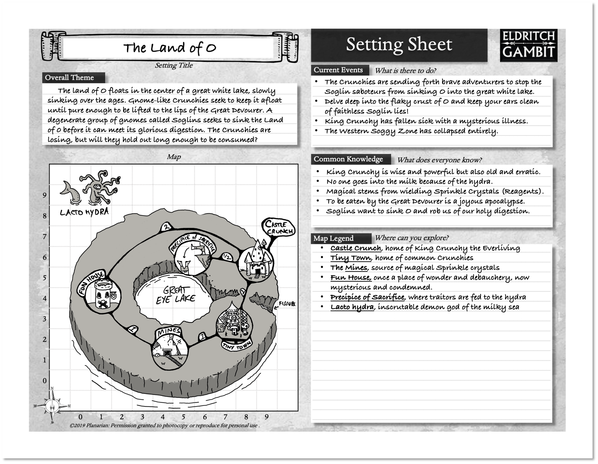
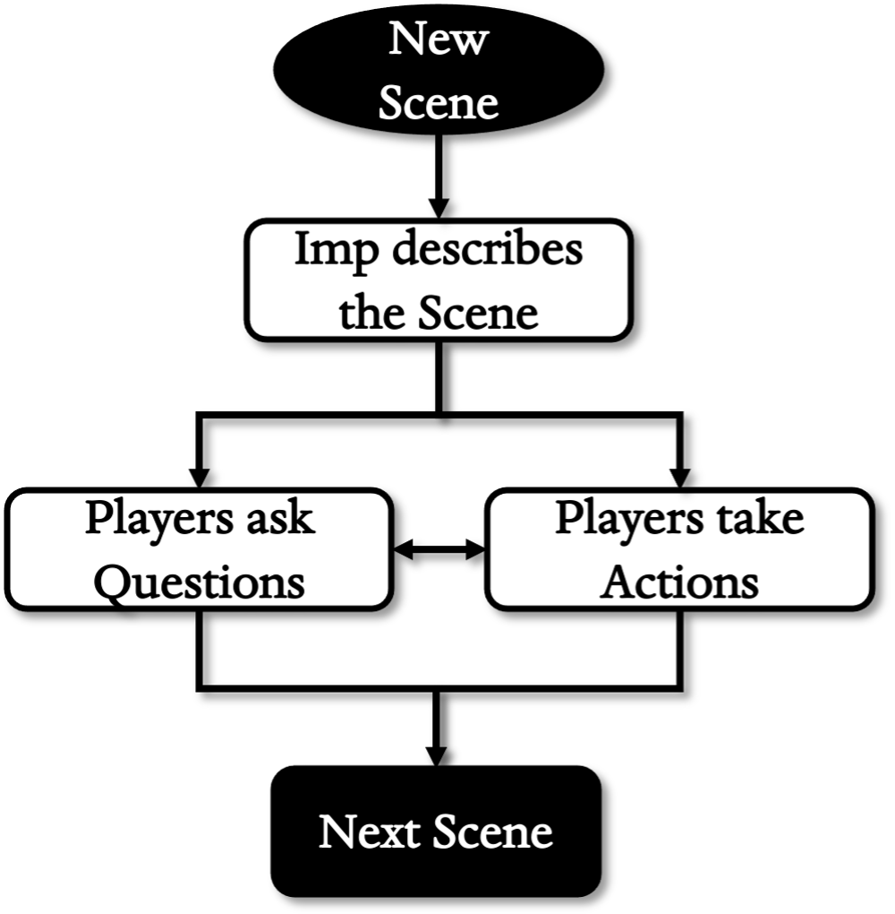

# IMP GUIDE
{: .no_toc}

## Table of Contents
{: .no_toc}

- TOC
{:toc}

## Setting Design

There are many approaches to designing a setting for your gaming group.
Groups typically use an existing setting, a custom setting, a random
setting, or a collaborative setting.

- **Existing Settings** are based on prior stories, such as from books,
comics, manga, television, movies, even other RPGS. Freeform character
creation is ideal for this, but you may need to adjust things, like how
magic works.
- **Random Settings** are based on die rolls or other methods and can
result in truly unusual worlds. You can use the seed prompts below
, find a random world generator online, flip
through a dictionary, consult a tarot deck, or use the cut-up technique
as inspiration.
- **Custom Settings** are authored by someone, usually the Imp running the
game. They already have strong ideas about the world and do not need
much from this guide. Like an existing setting, the work involves
checking to see if the rules of Eldritch Gambit mesh well with their
creative vision.
- **Collaborative Settings** are made bit by bit, using input from the
entire table. This includes the Imp as well as the Players! This seems
daunting but with the right group it can be lots of fun and result in a
world everyone is invested in.

Many settings are combinations of the above, so feel free to mix and
match. The following text focuses on collaborative settings, as they
need more explanation. If you don’t want to try collaboration, just
stick to the other, more traditional options.

###  Brainstorming

Collaborative settings are largely built “on the fly” by listening to
the ideas of your gaming group. Imps who go this route need to surrender
some of their authority over the content of the game to the Players.
This can be difficult and is not for all groups. Start small, plot out a
local village, city, or a dungeon instead of a whole world. You can
always collaborate again to grow new areas.

Base your design on the broad fantasies Eldritch Gambit was made for.
Tell your players this is a “fantasy” setting, where the key elements
are danger, adventure, and personal quests. These themes are intuitive,
interesting, and popular in fantasy media so this should not be hard to
sell as a starting point.

Next, ask for ideas about the area your group wants to play in. You
might want a whiteboard or other means for everyone to see the ideas all
at once. Start by writing down an idea of your own, then go around the
table, asking each Player for one thing they would like to see. Tell
them these should be constructive ideas – if they have an idea about
something they truly don’t want, they should suggest an alternative as
well. You can do this for several rounds but avoid going over three.

If an idea is not acceptable to any player, just cross it off the list.
If this causes a bitter argument, your group may have underlying
problems getting along with each other. Talk it out or try another
setting design method (existing, custom, random). This is a blessing in
disguise, as it is better to find out here than halfway through a
campaign. It is no failure to opt out of a collaborative setting and go
back to the other tried-and-true methods.

For example, the players may want things like “Sandworms” and “Flying
Islands” or “Betrayals” but may veto “dwarves” or “sado-masochism” or
tropes like “shadowy strangers handing out missions.”

Treat this as a creative aid rather than a contract. You can always use
your limited power as an Imp to influence how these ideas are expressed
in the story.

After laying out the big picture, you and your group can turn to the
setting sheet and start filling things in based on the ideas you
generated.

### Setting Sheet

Just like players get a Character Sheet, Imps get a ***Setting Sheet***.
This is intentionally designed for a small area to start with. Share
this with the Players, as this gives them an easy intro or cheat sheet.
It has fields for the name or title, a brief overview, what is currently
going on, what they should know, and a legend for the most interesting
spots on the map.

If you are working on a Collaborative Setting, your Players have a lot
of input on how each of the boxes on this sheet turn out. If you have
too many good suggestions (oh no!), hold a vote.

With
the other methods, these are primarily the Imp’s responsibility.

### Title

Here is where you put a few words to serve as a name. This should convey
what is compelling about the area you are playing in. As with
characters, setting names can be surprisingly difficult. Do not be
surprised if you end up deciding this last. One way to title the setting
is to name it after its most notable feature, like a huge mountain or
desert. If you need more inspiration, roll on the initials table back in
the character creation section.

**Examples:** *Esterossa of the Thousand Geysers, The Dragon-marked
Wastes of Thaal, the Emerald Vale of the Sandworms, etc.*

### Overall Theme

*What is it all about?* This is for describing the most meaningful
features of your setting, whether it is an entire world, a city, or a
dungeon. There is not much space here, and this is intentional. These
limits help focus what you are trying to get across. This may be
influenced by the setting suggestions your group came up with earlier.
You can start with a sentence and fill in more details later.

**Examples:** *A blasted wasteland filled with the mysterious ruins of
an ancient civilization, a lush forest populated by spider-riding elves,
a floating island doomed to fall when its Idyll tree withers, a meaty
railroad for tiny sentient mites etched out on the back of an unhappy
goat, a living dungeon held aloft by four guardian giants, etc.*

{: .text-center }
**OVERALL THEME SEEDS**

{: .lh-0}
| D20 |                                                    |
|-----|----------------------------------------------------|
| 1   | **Chao**s *– uncontrolled and vibrant.*            |
| 2   | **Crime** *– injustice, subterfuge, and violence.* |
| 3   | **Doom** *– facing down an encroaching end.*       |
| 4   | **Dreams** *– illusion, oracle, or imagination.*   |
| 5   | **Excess** *– decadent wealth or uniformity.*      |
| 6   | **Glory** *– enjoying the summit of existence.*    |
| 7   | **Hope** *– seeking out a promised future.*        |
| 8   | **Horror** *– touched by a force of terror.*       |
| 9   | **Lack** *– in dire need of a vital resource.*     |
| 10  | **Lost** – *unknown, forbidden, or deserted.*      |
| 11  | **Mystery** *– a piece of the puzzle is missing.*  |
| 12  | **Nature** *– the law of the wilds prevails.*      |
| 13  | **Order** *– rigidly bound and controlled.*        |
| 14  | **Peace** *– whether by pacifism or victory.*      |
| 15  | **Progress** *– the march of civilization.*        |
| 16  | **Ruin** *– shattered or decayed beyond repair.*   |
| 17  | **Sacrifice** *– something has to go, to go on.*   |
| 18  | **Strife** *– locked in struggle or war.*          |
| 19  | **Toil** *– kept aloft only by strenuous effort.*  |
| 20  | **Weird** *– eccentric and disturbing.*            |

### Current Events

*What is there to do?* This is a section to state outright what
conflicts and current events exist. Think of them like the chyrons on a
very biased news channel, giving concise but dramatic interpretations of
the events of the day. This gives players a clear idea what there is to
do, even if it is a “sandbox” setting largely up to their own whims. In
a living world, these should change as things develop. In the best of
cases, these may change if the characters make a mark on the game world!

**Examples:** *the Dark Lord’s army is advancing on Ogrefell, the
Tatzelwurm catch was unusually light this year, a second sun has
appeared and is driving the animals mad, a new tree of life has sprouted
from a dormant volcano, etc.*

{: .text-center }
**CURRENT EVENT SEEDS**

{: .lh-0}
| D20 |                                                    |
|-----|----------------------------------------------------|
| 1   | **Celebration** *– it’s that time of year again.*  |
| 2   | **Crime wave** *– fraud, theft, murder, etc.*      |
| 3   | **Disaster** *– a natural or unnatural tragedy.*   |
| 4   | **Eureka!** *– a new idea brings change.*          |
| 5   | **Famine** *– starvation and hoarding.*            |
| 6   | **Fugitives** *– feared folks are afoot.*          |
| 7   | **Gold rush** *– resources attract attention.*     |
| 8   | **Invaded** *– a hostile external force.*          |
| 9   | **Invading** *– conquering another place.*         |
| 10  | **Miracle** *– something amazing happens.*         |
| 11  | **Missing** *– a crucial person or thing is gone.* |
| 12  | **Plague** *– disease, vermin, or bad ideas.*      |
| 13  | **Politics** *– it’s time to choose sides.*        |
| 14  | **Rampage** *– big and bold troublemaker(s).*      |
| 15  | **Ransom** *– a hostage and demands.*              |
| 16  | **Rebellion** *– an internal struggle or coup.*    |
| 17  | **Scandal** *– a VIP did something naughty.*       |
| 18  | **Scapegoat** *– someone to blame for it all.*     |
| 19  | **Surplus** *– cornucopia & complications.*        |
| 20  | **Whodunit** *– a big case needs solving.*         |

###  Map

This is a small grid map for sketching out the setting. This does not
need to be in scale. The example map above is drawn as a point-crawl.
Each highlighted point or area is within a circle, and the lines between
show how many days it takes to travel between them. You may sketch
things out more loosely than this at first, or as a different style of
map.

The numbers to the left and bottom of the map are for placing areas of
interest randomly. To do this, simply roll two d10s. This gives two
numbers from 0-9 to use as coordinates for placing names on the map.

The die roll cannot fill the edges of the map randomly; if you want
something there you must place it there on purpose. If two rolled areas
overlap, reroll it or think up a clever explanation. For example, if you
roll up a city on the same square, maybe the city has two distinct
levels; one on top of the other, or maybe they exist in two different
dimensions. Maybe two factions are in a fight for its identity, or they
are just close neighbors. Take the prompt and run with it.

### Common Knowledge

*What does everyone know?* This is a few (3-5) interesting, useful, and
flavorful facts or rumors most people in the setting would know. These
bits of lore would mark one as a stranger if they were not aware of
them. “Everyone knows…” This helps the Players grasp what it is like to
live in this setting and what is unique about it. This is not
necessarily “lore.” Just because *everyone knows* something to be true
does not mean it is! As with the others, change these when the world
changes or when you want to put new ideas into the heads of your
players.

**Examples:** *witches turn you into toads if you ask them a question,
Good Queen Slaughterama controls the world through her monopoly on
scented soap, there is a cold war between the northern and western
kingdoms, no one goes into the southern wastes because they are haunted,
everyone wants to be a dragon knight, etc.*

### Legend

*Where can you explore?* Here is where you can list interesting places
for the characters to visit. If you are using a point-crawl map, you
should put each point here at least. These are inspirations for
adventure! Do not waste a legend entry on anything boring or on anything
you do not want to explore with your players. In the space it gives, you
should be able to provide a taste of what they would know as well as why
it is interesting.

**Examples:** *Filth-encrusted lair of the 2-star bandit, Sinkhole that
devoured the Lost city of Trang, Dungeon of Delirium, Tracks of the
Leviathan, secret passage to the treasure room, etc.*

### Adventures

When you have your setting started, the next step is to play in it. You
and your players will have to strike their own balance between a
free-form sandbox style of play and one guided by prepared events.
Either way, it is good to have some ideas of the trouble your party can
get into. Find a wealth of inspiration for these plots in fantasy
movies, books, comics, manga, anime, etc. Some fun tropes are listed
below:

{: .text-center }
**ADVENTURE SEEDS**

{: .lh-0}
| D20 |                                         |
|-----|-----------------------------------------|
| 1   | Avert a looming disaster.               |
| 2   | Build a movement, army, or business.    |
| 3   | Chase down a fugitive or foe.           |
| 4   | Deliver an important letter or package. |
| 5   | Destroy or obtain a dangerous Artifact. |
| 6   | Distract enemies to cover for allies.   |
| 7   | Escape from prison or a dire situation. |
| 8   | Escort a caravan over an unsafe route.  |
| 9   | Explore a new and mysterious place.     |
| 10  | Find clues to solve a mystery.          |
| 11  | Guard someone or something from foes.   |
| 12  | Hunt for a vast and fabled treasure.    |
| 13  | Infiltrate or spy on a dangerous foe.   |
| 14  | Keep a dangerous secret hidden.         |
| 15  | Provide aid during an emergency.        |
| 16  | Rescue someone from their captor(s).    |
| 17  | Sort out a complicated disagreement.    |
| 18  | Survive against mounting danger.        |
| 19  | Take part in a war or conflict.         |
| 20  | Uncover evidence of a nefarious plot.   |

## Advice

You can find heaps of general advice for running an RPG anywhere, so
this mostly specific advice for Eldritch Gambit. The most general advice
I can give is to always remember your Imp “power” comes from the
Players. If you abuse it, they might not show up for the next one. Try
to be fun and fair, but if you do nothing else, at least be their fan.

### The Imp Loop

Like Players, the Imp gets helpful procedures to follow if they are ever
stuck about what to do. If in doubt, describe what the Players are
seeing and answer questions about it. They will then either ask more
questions or start doing things. If they stall for too long, just ask
the central question:

**What do you do?**

When done, move to the next Scene.

{: .text-center }
**IMP LOOP**

### Session Zero

This is a short session held before the actual game starts or when
proposing the game to the group. This helps set expectations about how
long the game will last, how often it will take place and when, what
kind of events, challenges, or scenarios different players love or hate,
and how the group should behave.

- **Conflict:** A popular question is whether players can have their
characters attack or kill other player characters. If your group has
other ideas, set down how it should work here.
- **Imp Veto:** Make it clear you have veto power over things in the game
to keep things fun. This includes settling game-related arguments and
expelling problem players if they are ruining the experience for others.
- **House Rules**: If you have made any changes to the rules or added your
own, bring them up here.
- **No, please:** unexpected things may dismay players or the Imp and make
for a bad session. For example, phobias, traumas, and other triggers. It
is better to find out here than during play.
- **Yes, please:** on the upside, ask what the group wants to see in a
game. Do they love mysteries or horror? Dark games with a ray of hope?
chases? Seek input on this every session if possible.
- **Snacks:** Arguments about food and drink at the table can get
surprisingly heated, so it is best to lay these out beforehand. Do you
allow alcoholic beverages? Split costs for delivery food, etc.?
- **Missing Players:** if a player does not show, how will their character
be handled? Do they get lost or leave for another important errand? Does
a trusted player take them as a second? Does the Imp play them as a
background NPC?

Groups may have wildly different ideas of what is important, and
long-standing ones may not even need a session zero. Many have taken to
using “Safety Tools” like X-cards and questionnaires to avoid scenes
that may be unfun or traumatic. These methods are rapidly evolving and
can help you avoid trouble. Seek out the best method for your group.

### Encounters

The Imp gets to set up interesting Encounters for the party to face.
These may be monsters, enemies, neutral passerby, strange situations,
allies, etc. Some are random and some inevitable. Having a list of
random Encounters on hand is extremely useful.

After describing the start of the Encounter, ask the Players what they
are doing about it. For example, they may want to Sneak past, Parley,
Attack, etc. It’s more important to be flexible and allow good ideas
here than it is to follow procedure.

Adventurers tend to be troublesome and rile up all sorts of Encounters
on their own. If not, a good rule of thumb is to spring one after each
Montage Scene to keep them from getting complacent.

### NPCs

The most important parts of a fantasy setting are the aspects your
players interact with. In most cases, those things are the people,
creatures, and monsters dwelling within it. As the Imp, you can have any
number of NPCs. You do not need to work up stats or even a Threat level
for every passerby or minion your group faces. Perfectly good Imps often
just improvise believable stats as needed.

Characters should be able to get a reaction from an NPC. If they are
powerless to change them, they have little reason to interact with them
at all. If the NPCs have doubts, aims, secrets, and complexities, they
have reason to engage them… even if it might “ruin” the story. Care less
about your story; they tend to be better when they do not go how you
planned.

Creatures and Monsters should get similar respect. Every monster is
there for a reason and has a past to influence their actions. If you do
not ask why, your players will. If that happens, sit back, and let them
figure it out. You will be amazed at how inventive they can get undoing
your screwups.

### Arguments

Sometimes players and Imps spend a long time arguing over something that
is in the rules or should be (sorry). In this case, the Imp should
decide and move on with the game. Fair and fun matters more than right
or wrong, and it is not worth robbing everyone’s time and enjoyment
fussing over it. Players who still disagree should meet with the Imp
*afterward* about what the rules are or should be.

### Perception

Communication is confusing enough. It is crucial to let your players
know what their characters see outright without gating it behind dice.
This is why there are no Checked Actions to “notice” things in this
game. When they ask what they see, just tell them! If they search the
room, let them find things!

Sneaking and hiding calls for a Check each Scene to stay undetected. Use
your best judgment though; if the party opens a barrel, they find the
person hiding in it no matter their result. If there is a secret door or
trap, give them hints to inspire curiosity.

The closest this game gets to a notice or perception Check is the
Insight Action. If the Players see something they can use Insight on,
you get to reveal something interesting and *insightful* about it. For
example, everyone might see a fresco on the wall, but someone with an
artistic or stone working Skill might notice a keyhole in one of the
figures. They would not see the keyhole at all if they just walked
through.

If you still want perception or notice as a Check, you can easily house
rule it. Congratulations (or condolences?), you are a game designer now!

### Origin, Career, & Skills

Rather than having a set list of abilities to choose from, Eldritch
Gambit has free-form ones based on careers, backgrounds, or hobbies. The
intent is to encourage abilities that accurately reflect both the
imagined character and the living-world setting.

One concern is players may abuse this freedom and choose OCS applicable
to anything. They could, but specific OCS still work better. Anything
too broad, however cunningly worded, backfires if not strongly relevant.
This is especially true if other players have more specific ones to
compare to. After all this, if you still see a wording as game-breaking,
veto it and have the Player make up a better one.

It is fine for an Imp to tell a Player their Career or Skill does not
apply to a Check. If you think they are stretching it too far, the
burden is on the Player to trick you into thinking otherwise. If this
causes a lengthy argument, table it for discussion later.

### Mixing it Up with Checks

Each Action or Montage gives an Attribute that makes sense for it, but
this is just a recommendation. If it suits the character’s approach and
the demands of the scene, a different Attribute might be better. For
example, in a drinking contest to get information from a rowdy bandit
camp you would still be using Parley for the outcomes. The relevant OCS
would however change to ones suggestive of a high alcohol tolerance
(Student, Hold liquor, etc.) and the Attribute would change to End. As an Imp, try to do this when it favors
your players rather than using it as a gotcha. Listen carefully for when
they want to use alternative Attributes on their own.

### Failing Forward

In concept this is a simple idea: a failure should still move the story
forward somehow. If nothing happens, it can be boring for everyone
involved. The classic example is lock-picking, where one can just try
and try again with little in the way of consequences. A consequence
moving the story forward is better, such as the noise alerting guards or
running into a competing group of thieves. You can even suggest a
success with cost on a failure, such as managing to get through the lock
but destroying it in the process.

Gambits play with the idea of falling forward in an interesting way.
Using a Gambit on a failure can lead to either a success or a Botch. The
Botch result should be both worse and more unlikely. In the lock-picking
example, a Botch could break the lockpicks or make so much noise you
alerted those inside.

If one can just retry a given action, and it is reasonable they would
succeed eventually, do not bother with the Check. This goes back to
prior advice about not calling for a Check if there is no meaningful
consequence for failure.

### Freeform XP

This method can be freeing for some groups and daunting for others. Imps
may fear a perceived loss of control over the direction of the game.
“…but what if my players want to do things outside of the spirit of this
game?” Unclench. In my experience running and playing in many other
games since the early 80s, Players do what they will regardless of how
you dole out XP. If you must still look at it as a “reward,” let it be a
reward for recounting things the players themselves found fun and
worthy.

Imps do not actually reward XP in the rules as written. If they did, one
could get into the mindset of bribing players into the “right” strategy
for playing. This is something players should do on their own.

You may feel the urge to reward a good player with XP or rerolls or
whatever for doing something cool. Consider rewarding them more directly
in the way the scene plays out instead.

Some consider this method controversial. If you are one of them and this
freeform XP does not work for you, you are more than capable of patching
in a more traditional set of rewards from other games. Try to keep them
within the same range of XP per session and there should be little
trouble.

### Missing Players

While it is best to have everyone at each game, we all know things do
not always work out. You want to reward consistent players without
crucifying those who miss a game or two. Missing players can still get
their overdue XP by recalling their Highlights from the last session
they attended. They can also get a “make-up” XP for each missing session
by explaining what their character was up to and how it brings them back
into the current events.

### New Characters

Sometimes a new player joins the group, a character dies, or a player
just wants to play a different character. Aside from using a backup or
creating one from scratch, painless ways to introduce a new character
include having them be the lone survivor of another failed party or an
interesting NPC uplifted to PC status.

A new character should start at the lowest Level already in the group,
at least. A replacement should have the same Level/XP as their old one.
Let them choose Weapons, Armor, Spells, and other Items for new or
replacement character, as long as they do not outclass the rest of the
group or tempt your veto.

### Lagging Characters

Level differences within a party are expected and not usually a big
deal. Sometimes a character may end up with a much lower Level than the
rest of the party, however. The Imp may give this character double XP
until they catch up with the rest of the group, on the rationale they
are learning from their betters.

### Troubleshooting

As the Imp you want to keep a finger on the pulse of your gaming group
so you can adjust things. It’s always good to check in and talk with
your players, but often there are things going on that are hard to
express. Fortunately, some of the mechanics used in this game also serve
as diagnostic tools:

- **Gambits:** these quickly separate Players into gamblers and those who
play it safe. This is fine, you can play without ever touching Gambits!
However, if no one is using them, ask yourself if *you* might be the
cause. Are you too hard on them for Botches or too stingy with
Criticals? If so, adjust your attitude and make them more appealing.
It’s hard to go too far in the forgiving direction.
- **Willpower:** how much visceral struggle is in your game can be
revealed by how many Rerolls your players use. Ideally, they should
spend some but only rarely to the point of dropping to half. No or
little WP spending implies your games may be too inconsequential, too
much might mean you were overly harsh. Sometimes that is appropriate for
very tense sessions, but if it is too common you might want to dial it
back a bit.
- **Experience:** listen when your Players tell you what they deserve XP
for, because they are also telling you what they want to see more of. If
they cannot think of anything they did to deserve XP, you can help them.
If you are both stuck, maybe it is time to open up a conversation about
what the group is really looking for in a game.
- **Fudging:** not actually a mechanic, but some Imps feel the dice need
help getting the story “right.” If you find you regret the way the dice
went and want to “fudge” or change the result, you may be calling on
them too much. Try cutting back on the Checks and just saying “yes” more
often. If a die result could really ruin the game, why use them at that
point? Dice are only a randomizer; they are not the heart of the game.

On the other side, you may feel like you are doing everything wrong and
wondering why they keep coming back and having so much fun. This is
pretty much how every good Imp feels at times, so relax.

###  Tweaks and Hacks

Eldritch Gambit can bear house rules and options without groaning under
the strain. Some examples:
- **Exploding dice:** if you want more unpredictable and deadly combat,
consider using “exploding dice.” With this tweak, any time you Roll the
max on a damage die, Roll it again and add the results. This can result
in the occasional huge damage result and makes small damage dice more of
a threat. This tweak can be polarizing; some players love it, but others
outright hate it.
- **Static damage:** Imps may want a relief from rolling damage for NPCs,
especially during clashes. It is fine to use a static value of half the
die max, plus any modifiers. If it starts to feel too predictable,
switch it up with a die roll sometimes. You can do this for PCs as well.
- **Weapon degradation:** rarely, a group will want to feel like their
weapons could break or blunt with use. If they Roll a 1 for damage, the
weapon downgrades to one die type lower (i.e., d8 to d6), to a minimum
of d4. The Crafting Montage can repair all degradation, at the usual
Difficulty for the weapon.
- **Setting perks:** consider special features for characters to enjoy
that come from just being in that setting. Birthday bonuses,
astrological signs with real effects, modifiers for coming from
different regions, blessings of the gods, etc.
- **Specific wounds:** the Stagger penalty is a great general solution and
is meant to reflect general shock and injury. You can spice things up
with a specific set of injuries like head trauma, missing limbs,
bleeding, etc. One way to do this could be a table to Roll on after
Stagger.
