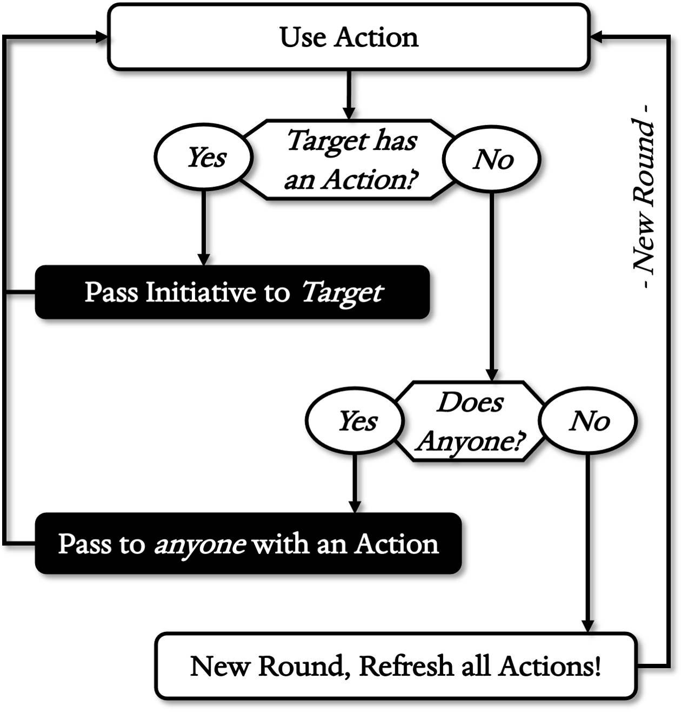

# SCENES
{: .no_toc}

## Table of Contents
{: .no_toc}
- TOC
{:toc}

## Staging

A scene is just imaginary time and space in which things happen. Staging
is the background parts that help Scenes work, resolving time, space,
and spotlight with a few simple rules.

### Time

Fussing over exact measures of time within an imaginary world rarely
leads to memorable stories at the gaming table. Instead, Eldritch Gambit
uses just two types of Scenes to do this: ***Action*** and
***Montage***.

- **Action Scenes** are for fast-paced dramatic Actions
like fighting, sneaking, and persuasion. These usually take only seconds
or minutes. Action Scenes can be further divided into roughly six-second
Rounds when Initiative is declared.
- **Montage Scenes** are for long Montages taking
hours to weeks. Any task that would eat up most of a day is probably a
Montage. These include events like travel, healing, training, and
shopping. Montages take a long time for the characters, but to the
players they are mercifully brief.

Other measures of time can include ***Session***; meaning the entire
game that day, or ***Campaign***; meaning a series of Sessions fitting a
theme.

### Distance

Eldritch Gambit measures distance in loosely defined imaginary spaces
called ***Zones***. These are based on obstacles and areas of interest
more than strict space: a small closet can be a Zone, as can a coliseum.
Larger areas are often split into several Zones to keep things sensible.
Zones are things unto themselves and can have interesting features, such
as Cover, obstacles
, etc.

This method works well with both theatre of the mind and table maps.
Defining an area in Zones encourages clever tactics and engaging
narration of their features. If you are using a dry-erase map (and
minis!) you can even trace out the Zones in color.

Because Zones vary in size, effective range and movement also vary
depending on how many Zones an area is split into! If this seems
baffling, consider that small, cluttered areas are also hard to aim
around or move through. The effective range of a move or weapon is not
going to be as far as on a large Zone like a flat plain.

### Initiative

This decides who-goes-when in Action Scenes where the order matters,
usually combat. Eldritch Gambit uses a modified version of Elective
Initiative called “Volleyball” Initiative. The one proposing the first
hostile Action both holds and triggers ***Initiative***. If there is an
argument, let the Imp decide or just check who has the highest current
WP.

The one holding Initiative gets to take the first Action. If their
target has an Action, that target must go next. If more than one target,
they may choose from the survivors. If not, the holder hands it to
anyone else with an Action. If they choose a foe, they can specify or
let the Imp decide which one.

Initiative splits an Action Scene into ***Rounds***. When everyone has
spent their Action, a new Round begins. Everyone gets their Action back,
and the last holder can now pass Initiative normally. They may even pass
to themselves if they did not target anyone.

One may ***Wait*** by selecting a specific Action, such as “ranged
Attack” and holding off until the right moment. They may take that
Action any time later, even if it interrupts someone else’s. They cannot
change the type of Action. If no opportunity arises, they decide at the
start of the next Round to keep waiting or rejoin the regular Initiative
scheme.

Initiative ends when the conflict is over, by whatever means. Refill HP
back to maximum unless the character is Fallen or otherwise cannot
Rally.

{: .text-center }
**INITIATIVE**

### The Anycheck

Imps can handle just about any action by making a decision or calling a
“fiat” Check on the spot. The Actions and Montages below are only
specific cases, or “successful recipes” derived from the Basics given
earlier in this book. They are not *demands* about how you must play the
game.

You can view the Anycheck template as a sort of “universal” Action or
Montage. This should make it easier to deal with unexpected tasks
without having to comb through this chapter each time. It also helps
when designing your own Actions or Montages.

The first part of each Action or Montage just tells what it is and when
you might use it. The Check or Roll tells you what Attributes and/or
Defenses are *usually* involved. The OCS line tells what sort of
Careers, Origins, or Skills (***OCS***) grant a d20. Next comes a list
of suggested outcomes:

**Roll/Check:** Roll or Check, suggested stats. \
**OCS:** Relevant Career, Origin, or Skill examples.

{: .outcomes }
>-   **Critical:** Success with an extra benefit!
>-   **Success:** You overcame the situation.
>-   **Failure:** The situation overcame you.
>-   **Botch:** Failure with an extra drawback!

You can enrich your own settings by making special Actions or Montages
to fit them. Before doing this though, ask yourself three things: First,
does an existing Action or Montage already cover it? Second, does the
outcome truly need a random element? And third, would success or failure
be interesting enough to drive the game forward?

### Defaults

All Checks below include suggested defaults for Criticals and Botches.
As described above in the Basics section, they are there for two
reasons. The first is to make choice a *choice* – if you want to move
on, just use the default! They are perfectly suitable for most
situations. The second is to give an out for the Player or Imp if
haggling over a Critical or Botch becomes contentious. Once either party
choose the default, you can end the discussion.

To be clear; *you are not stuck with the defaults in the Outcomes
tables*. You may choose others if they look fun and make sense.

## Actions

Most games spend the bulk of their time in fast-paced ***Action***
Scenes. These support combat, persuasion, magic, stealth, intrigue,
chases, athletics, etc. While it is fun to role-play these to the hilt,
it is not crucial that a player be good at these personally. You do not
need to be a trained fencer in real life to Attack, nor a suave diplomat
to use Parley. It is enough for the player to describe what the
character is doing and let *their* abilities fill in the rest.

The combat-focused Actions (Attack, Grapple) all Check with a d20, at
least for adventurers. Other Actions Check on a d12 unless the character
has the right Origin, Career, or Skill (OCS) to support it.

When Initiative comes into play, an Action Scene splits into Rounds.
Each Round, combatants get an Action as well as an extra Move Action
. This ***Free Move*** must be used *before* their
regular Action or it is wasted. If the Action is lost for any reason, so
is the Free Move. Free Moves are never Checked and thus cannot be used
to pass obstacles.

###  Attack, Melee

Do violence to a foe from within the same Zone, such as swinging a
sword, throwing a punch, flailing wildly, etc. Melee attackers must
choose Gambits wisely, weighing the chance for a decisive strike against
that of a humiliating counter. The Player may describe an attack as one
blow or many. If successful, Roll the damage dice for the weapon and add
any mods, then subtract this from the target’s HP.

**Check:** Dex vs. AF. \
**OCS:** All adventurers use d20 for Attacks.

{: .outcomes }
>-   **Critical:** hit and add *Bonus damage* equal to the max of your
    usual damage die.
>-   **Success:** hit & Roll damage + mods.
>-   **Failure:** clash, both sides Roll damage + mods, winner
            inflicts excess on the loser.
>-   **Botch:** C*ountered*: miss & take hit from foe!

On a *Critical*, the extra damage is equal to the highest possible
result on their largest damage die. For example, a fist-fighter with +2
Str (1d4+2 dmg) would do 1d4+6 on a
Critical. A *Botch* is a counter: inflict the foe’s best melee damage on
the attacker.

A *Failure* or “clash of arms” starts a Roll-off using the best damage
dice for their wielded weapons. For example, two fist-fighters Roll 1
and 3 as damage. The one with 3 wins and does 2 damage (3-1) to the
loser.

- **Area Attacks** blast everyone in a Zone with no Check.
- **Disarm Attacks** twist or slap a weapon out of grasp. This is a sort
of physical “deal” - If the target drops it, they avoid the damage
- **Provoke Attacks** draw a foe’s attention. Like disarms, if a foe
agrees to target them with their next Action (if possible), that foe
avoids damage.
- **Split Attacks** divide the Action into two attacks, each using a d12
instead of a d20. These can use the same or different weapons. One
cannot make a Split Attack while Staggered.
- **Subdual Attacks** knock a foe out. Non-stun weapons do half damage,
but on a Felling blow, the target is Incapacitated instead of taking
damage.

Area and Split attacks may leave multiple choices for passing
initiative. If more than one target survives with an Action, the
attacker chooses among them.

Wielding multiple melee weapons offers no benefit aside from a wider
array of attack types.

### Attack, Ranged

Do violence upon a foe from afar; fire a bow or crossbow, throw a pebble
(quite thrilling!), cast an aimed Spell, etc. Ranged attackers weigh the
chance of a kill shot against missing, or worse – accidentally shooting
a nearby ally. If successful, Roll the damage dice for the weapon and
add any mods, then subtract this from the target’s HP.

**Check:** Dex vs. AF. \
**OCS:** All adventurers use d20 for Attack.

{: .outcomes }
>-   **Critical:** hit and add *Bonus damage* equal to the max of your
    usual damage die.
>-   **Success:** hit & Roll damage + mods.
>-   **Failure:** foe evades your shot.
>-   **Botch:** *Friendly fire*: target chooses another to
                take the damage! If none, just a regular miss.

Eligible targets for a Botch are those in the same Zone or line of fire.
It’s easier to aim with no allies in the way, making it safe to Gambit
on a Failure.

You can double a weapon’s range in Zones by downgrading the Check to a
d12 instead of a d20. For example, a range 2 weapon can reach up to 4
Zones in this manner. You cannot do this if Staggered.

You can throw a non-ranged melee weapon and treat that as a Ranged
Attack. This avoids clashes and counters, but such an errant throw can
only be made within the same Zone.

As with Melee, Ranged Attacks can also be *Area, Disarm, Provoke,
Split,* or *Subdual*, depending on the weapon. Split attacks can only be
made with two different weapons or one that does not need a Load (Use)
Action every firing. Otherwise, wielding multiple ranged weapons offers
no benefit aside from a wider choice of attacks.

###  Dispel

Casters need not endure the magic of others. This Action forcibly ends
another caster’s Spell. Dispel is a Check of Wis vs. their WP with a Range of 1. This Check
uses a d12 if the caster has access to *any* Spell, and a d20 if they
can cast *any* of the Spells affecting the target. An Ephemera can
Dispel but this uses up a Charge. Dispel can also unweave the magic that
animates creatures with the Unstable Trait, such as undead and summons.

**Check:** Wis vs. WP \
**OCS:** None, d12 if caster has any Spell, d20 if same Spell.

{: .outcomes }
>-   **Critical:** Choose Spells to dispel.
>-   **Success:** Ends all Spells on or from target.
>-   **Failure:** Spell persists.
>-   **Botch:** *Countered*, persists & dispeller Confused.

The Confusion on a Botch ends next Scene. A Botch can also cause a
*harmful* Spell to spread to the dispeller as well, like an infection.

If there is more than one Spell on the target, Dispel rids reality of
them all. Treat these effects as ended and apply the consequences. On a
Critical, the dispeller can pick and choose.

Dispelling
an Instant Spell requires the Wait option during Initiative. A Dispel is
also effective in the gap between an Overcharge and the actual casting
of an Instant Spell.

###  Dodge

A last-ditch defense that goes beyond relying on passive AF. Dodges can
be made immediately after being Attacked, even interrupting a Split
Attack to do so. Check AGI versus the result of the foe’s original
Attack Check. If successful, the attack misses. If it fails, the attack
resolves as it normally would.

**Check:** AGI vs. Attack result. \
**OCS:** All adventurers use d20 for Dodge.

{: .outcomes }
>-   **Critical:** avoid attack & choose to inflict the *Countered* or
    *Friendly fire* Botches on foe.
>-   **Success:** you evade your foe’s attack.
>-   **Failure:** your foe’s attack lands.
>-   **Botch:** *Stumble*, lose next Action getting up.

This defensive Action is unusual because you can choose to Dodge even a
*failed* melee Attack. This lets one avoid a clash-of-arms Roll-off,
which is great if they are likely to lose such a vulgar contest of
might.

A Critical lets one Counter or apply the incoming damage as Friendly
fire to another eligible target. An “Eligible” target means in the same
Zone or line of fire. These work the same as the default Botches for
ranged or melee Attacks, above. If these don’t apply, don’t go for a
Critical or think up another way it could benefit the dodger.

###  Grapple

This restrains or controls a foe with a grab, hold, pin, or throw.
Grapple is a Check of Dex vs. AF. If it
hits, both sides Roll-off unarmed damage against each other. The one who
rolls highest is the “winner,” inflicting any excess damage and the
***Grappled*** status on the “loser.” This means the loser loses their
Action until they escape.

**Check:** Dex vs. AF. \
**OCS:** All adventurers use d20 for Grapple.

{: .outcomes }
>-   **Critical:** hit as below & add bonus grapple damage equal to the
    max of your usual die!
>-   **Success:** both Roll-off unarmed damage + Str; winner inflicts excess & Grappled
        status.
>-   **Failure:** an impasse, neither side Rolls.
>-   **Botch:** *Countered*, miss and take hit from foe!

Both sides make a new Roll-off each Round to keep the hold unless the
loser Submits. Submitting just avoids further hurtful Roll-offs in
exchange for not resisting. Neither side needs to Check again, only
Roll. If the loser wins the Roll-off later, they may escape instead of
reversing the hold. As the loser has no Action, the current winner
passes Initiative to anyone else with an Action.

You can choose other effects below instead of inflicting the Grappled
Status. The loser keeps their Action in these cases, only losing their
Free Move.

**Seize:** The winner grabs an item or weapon out of the loser’s grasp
and into theirs. This is similar to Disarm but the winner now wields the
item.

**Push/Pull/Carry:** The winner moves the target up to a Zone away and
may come along. This can move the loser into or away from obstacles.

Grappling requires a free hand, but weapons do not interfere much. Some
weapons even have the Grapple property, such as man-catchers and whips.
These use their damage for the Grapple Roll.

### Guard

This protects a more precious ally within the same Zone. The guarding
character simply steps in as the target of an Attack made on someone
else. This interrupts normal Initiative. An Attacker can get past a
Guard with a Critical, but this only does regular damage (no *Bonus
damage*) to the original target.

### Insight

Remember, investigate, interrogate, pontificate. This uses the
character’s knowledge to reveal helpful facts. For example, a sorcerer
remembering what an Ephemera does, a scholar translating runes inscribed
over a door, a woodsman following tracks, a tailor guessing how long
petrified noble’s outfit has been out of style, a gambler figuring out a
tell, a delver examining a trap etc. It is up to the Player to explain
why their OCS grants them relevant info.

If the info is for specific knowledge, this uses Wis vs. a DF based on how rare the knowledge
is. Insight about a target’s state of mind is Wis vs. WP instead. Success means the character
knows the answer. The Player should frame these questions carefully and
Imps should be generous! There is no real drawback to giving out info to
help move the game along.

**Check:** Wis vs. WP or variable DF (usually 10). \
**OCS:** Investigation, tracking, crafting, etc.

{: .outcomes }
>-   **Critical:** Imp answers two relevant questions!
>-   **Success:** Imp answers one relevant question.
>-   **Failure:** only info they should know outright.
>-   **Botch:** one right and one wrong answer!

On a Botch, the Imp should make it hard to tell which answer is right.
Of course, they can also grant two *right* answers just to inflict
doubt!

This game does not use Checks to “find” or “notice” things. Instead, you
use this to *understand* what you are seeing. Likewise, Insight never
tells you if an NPC is lying outright. Rather, it presents an
opportunity to reveal suspicious or inconsistent parts of their story.

Just having the right OCS entitles one to a lot even without a Check.
For example, a woodsman easily finds tracks but may need a Check to
guess what they are carrying or where they are going.

###  Move

Running, climbing, fleeing, jumping, swimming, scaling massive foes,
evading traps, etc. This moves the character into an adjacent Zone. It
is rarely Checked unless there is an obstacle or trap. Faster creatures
may move more Zones in a Move, while slow ones take more Moves to cross
a Zone.

This Action is special because everyone gets a ***Free Move*** before
their Action. Using the Free Move then a Move Action is “running,” and
crosses two Zones. A Free Move is never Checked and cannot pass an
obstacle or trap – if they try, it becomes their regular Move Action.
This slows those who did not take the quick and easy path.

**Check:** none, or Agi vs. DF of the
obstacle. \
**OCS:** athletic or travel related.

{: .outcomes }
>-   **Critical:** overcome, plus *Aid ally* or *Hinder foe*.
>-   **Success:** overcome obstacle or trap
>-   **Failure:** halted by obstacle or trap
>-   **Botch:** *Stumble*: lose next Action!

Three things that may call for a Check are chases, obstacles, scaling
larger foes, and traps:

- **Chases** involve quarry and pursuers using Move Actions through a set
of chase Zones, with the quarry deciding where to go. Obstacles often
determine who wins.
- **Obstacles** like walls, rivers, brambles, etc. hinder moves into that
Zone. For example, a wall must be scaled or breached to enter.
- **Scaling** larger foes that count as their own Zone or
more to climb upon and deal with riders, etc. The DF for this is the
larger creature’s AF.
- **Traps** harm those who fail to Move past.

### Overcast

An ***Overcast*** charges up certain Spells for a more devastating
effect. A Caster may spend their Action to add a die to an upcoming
Spell with a Rolled effect or damage die. The overcast Spell must be the
very next Action. For example, a caster using a Seeker Spell that does
1d8 +Cha damage would Overcast their
Spell as one Action, then cast it for 2d8 +Cha on their next.

All other Spell features remain the same. If a Spell does not have a
Rolled effect, it does not benefit from an Overcast.

### Parley

Haggling, seduction, diplomacy, lies, threats, bribery, negotiation,
persuasion, etc. are valid alternatives or preludes to battle. Most
conversations need not call upon dice, but this can divine one if an NPC
reaction is uncertain. Parley can make a charismatic “face” party member
even more useful. Keep in mind that this is not mind-control; it only
shifts the tone.

Parley is a Check of Cha vs. WP. Leverage
for or against may grant a bonus or penalty. In a diplomatic Scene, the
sides may each get turns to influence each other with different
arguments or offers.

**Check:** Cha vs. WP. \
**OCS:** con-artist, merchant, politics, romance, etc.

{: .outcomes }
>-   **Critical:** best possible reaction!
>-   **Success:** they react better to what you say.
>-   **Failure:** their reaction fits the situation as-is.
>-   **Botch:** their reaction to you worsens!

The Parley Check shifts the narrative for better or worse, but the
possible outcomes still depend on context. Targets also stay true to
their nature even on an extreme result. For example, a success when
flattering the king may yield a gift, while a success when insulting the
king may only stun them long enough to flee. A valid threat may still
intimidate on a Botch, but they may misinterpret what you want them to
do.

*Players* on the losing side of a Parley are still in charge of their
characters and can even reject the outcome. They can also be good sports
instead; going along with it and proposing different outcomes. This is
also a good excuse for an XP Highlight.

###  Perform

Impress, sway, or draw a crowd with singing, comedy, oration, dancing,
instruments, etc. Perform is a Check of Cha vs. the highest WP in a crowd. Performers
may get a bonus if they know what a crowd wants to see or hear. This
also makes a great distraction so other party members can do more
nefarious things.

**Check:** Cha vs. WP (or highest WP of
audience). \
**OCS:** oratory, musical, dance, comedy, etc.

{: .outcomes }
>-   **Critical:** a rousing performance, achieve fame in the area!
>-   **Success:** a pleased and interested crowd gathers.
>-   **Failure:** little interest or attention.
>-   **Botch:** the crowd becomes hostile or leaves!

Performers in a diverse group or band may use Teamwork, condensing their
efforts into a single Strongest-link Check of the highest Attribute and
most relevant Skill. If missing a part (drummer, clown, etc.) they may
incur a penalty.

### Rally

A pause to steel your nerves and catch your breath during combat. This
restores 1d4 + End HP, up to the
character’s maximum. One can only Rally if *chosen* to receive
Initiative by another. They are too distracted to Rally if a friend or
foe *targeted* them with an Action before passing on the Initiative.
It’s hard to Rally alone - or with allies who do not have your back!

An upside to this is that instead of their own End, the rallier may use the Cha of the ally that passed Initiative to them.
Play this out with a few words of encouragement.

Heavier armor grants a larger Rally die. It is
good strategy to take cover, feign death, or retreat at low HP so you
can Rally. You can then re-enter the fray in fighting trim.

**Roll:** recover 1d4\* + End HP.

*\*unarmored - armor improves this die.*

When the conflict fades and Initiative ends, HP returns to maximum
without a Rally.

One cannot Rally while taking ongoing damage, such as from the Burning
Status.

###  Sneak

Moving silently and hiding in shadows is a terrific way to evade foes
and get into places you are not supposed to be. This only allows you to
*remain* unnoticed by others. It is not possible if someone is looking
right at you, or if you have nowhere to hide. Sneak is a Skilled Check
of Agi vs. the foe’s WP, or the highest
in a group.

**Check:** Agi vs. WP. \
**OCS:** criminal, acrobatic, wilderness, etc.

{: .outcomes }
>-   **Critical:** sneak past even alert foes!
>-   **Success:** sneak past most foes.
>-   **Failure:** sneak past sleeping or distracted foes.
>-   **Botch:** everyone notices you!

The outcomes of Sneak depend on how alert the foe was in the first
place. An ***Alert*** foe has reason to suspect someone is trying to
sneak past or hide from them. Most foes, even guards, do not fall into
this category unless something has gone awry already. A foe may be
***Distracted*** by something, such as a tossed pebble, ongoing card
game, minstrel show, etc.

Cover is necessary for Sneak, whether from darkness, a
crowd, or obstacles. Penalties for darkness or visibility also affect
the sneaker, however, causing them to stumble around noisily in the
dark. Distractions, such as allies using Perform or Parley, can also
count as cover.

The start of an encounter often presents the opportunity to Sneak up on
or around foes. If this works the party can avoid them, eavesdrop, or
launch a ***Surprise Attack***. The latter inflicts the Surprised
Status: foes lose their Action that round and halve their AF. This lasts
until next Round.

Imps should only call for a single Sneak Check once during Action or
Montage to remain unnoticed. More than this skews unfairly toward
discovery. Insight Checks do not reveal hidden characters but may grant
clues leading to their discovery.

Sneak can also pickpocket, steal or plant small items by switching to
Dex and a relevant OCS. This should be
limited to items of about 1 Load whose weight will not be obvious in its
relief.

###  Use

This covers miscellaneous moves using a tool or item. Some tasks can
take several Use Actions. For example, pulling something from a sack or
bag is one Use Action, while using the item pulled from it afterward is
another. Like Move, most casual Use Actions like pulling a lever,
reloading a weapon, or drinking a potion do not require a Check. For
complex, risky moves like picking locks, using a grappling hook, or
disarming traps, the Outcomes are as follows:

**Check:** usually Wis vs. situational
DF. \
**OCS:** any crafting, thievery, artistic, etc.

{: .outcomes }
>-   **Critical:** Finished the task very quickly!
>-   **Success:** Did what the tool or item does
>-   **Failure:** Did not finish the task
>-   **Botch:** Cannot finish task, broke tools, etc.!

As the name implies, you usually need the proper tools to even start.
Sometimes you can jury-rig tools out of whatever is nearby, such as
making lockpicks out of a hairpin, etc. These typically allow a Check
but at a -2 penalty or worse.

If the DF is well within the range of the character’s ability with no
pressing consequence for failure, using things is best left to
narration.

## Montages

Transitions between more climactic events, ***Montages*** are lengthy
periods in the story condensed into brief moments of play. Long
journeys, smithing projects, healing, etc. are all handled this way. To
do this, the Imp allows each player one Montage then moves along to the
next player or Scene. This helps with pacing and avoids entire sessions
of agonizing over minutia.

Sometimes players pursue Montages on vastly different time scales. For
example, one PC may go on a week-long journey back to town while the
others fix up some broken gear. It may be fair to give an extra Montage
to those working on shorter projects.

During a Montage Scene, the rest of the world may advance their plans
and agendas as well. Some Imps may keep track of how many Montage Scenes
can take place before an event occurs, good or bad.

Like Actions, it is fine to have Montages succeed without Checks. This
is often the case for travel to a familiar area and other things that do
not need to be played out. As usual, if one does not have the right
Career, Origin, or Skill (OCS) for the Montage, the Check uses d12. If
they do, it uses d20.

###  Crafting

If players want to make or repair something, they must have the right
tools and materials. They then Check Wis
with a relevant crafting OCS. Crafting Checks should only be called for
if there is time pressure or real doubt about making the item. For
example, the first time making it or when going for a Critical. DCs for
crafting vary:

-   Weapons: DF is 5 + the max on the Damage die.
-   Armor: DF is 5 + the max on the Rally die.
-   Other/Ephemera: local Travel DF or higher.

**Check:** Wis vs. situational DF. \
**OCS:** any crafting career, writing, painting, etc.

{: .outcomes }
>-   **Critical:** Superior item or extra item!
>-   **Success:** Well-made item.
>-   **Failure:** Inferior item.
>-   **Botch:** *Waste Resources*: lost materials!

A Superior tool raises the bonus to Checks made with it by two, a weapon
raises to hit *and* damage bonus by one, and armor has one lower Load.
The opposite is true for Inferior outcomes, so lower the bonus by two
for tools, one for weapon hit and damage, or add 1 Load to Armor.

###  Fellowship

Even successful adventure is harrowing, reflected largely by WP loss.
Characters can avoid isolation and despair by bonding with and
supporting each other via ***Fellowship***. For example, they may buy a
round of beer and cheer their traumatized friend at the bar, have a long
and insightful discussion, romantic interlude, cathartic argument, or a
friendly brawl. During Fellowship, each player involved gets WP back.
Fellowship is a Strongest-Link Skilled Cha Check vs. the lowest current WP in the
group. Look to films, books, and movies for examples of this.

**Check:** Cha vs. WP (current lowest). \
**OCS:** counseling, carousing, humor careers.

{: .outcomes }
>-   **Critical:** Everyone involved regains 4 WP!
>-   **Success:** Everyone involved regains 2 WP.
>-   **Failure:** Everyone involved regains only 1 WP.
>-   **Botch:** No one involved regains WP!

One way to do this is to have characters ask each other meaningful
questions. For example, *“What rattled you so badly during our last
fight”, “Why do you drink when I bring up my hometown?”, “What were you
talking about with that shady customer back in the shop?”* The answers
do not need to be honest or even answered at all. If the players seem to
be managing Fellowship without questions, ignore this method and enjoy
the drama.

For Fellowship to work, there must be more than one character involved.
If the group is fractious, different cliques may have separate
Fellowship scenes with each other. Those using their Montage for other
Actions miss out on the WP recovery.

###  Recovery

Staggered or Fallen characters may recover with time and proper care.
This is a Check of Wis vs. the local
Travel DF, Disease DF, or negative HP of the patient, whichever is
greater. OCS related to medicine grant their d20. Success just means
stability for now, only a Critical clears a Status. The character making
the Check decides which available Status they clear or accidentally
inflict.

**Check:** Wis vs. DF of local Travel,
Disease, or -HP. \
**OCS:** herbalist, healer, doctor, surgeon, etc.

{: .outcomes }
>-   **Critical:** Clear Staggered or Fallen!
>-   **Success:** Stable, no change until next Montage.
>-   **Failure:** Inflict Staggered, Fallen, or Dead.
>-   **Botch:** Dead!

Fallen characters get a Check to recover on their own while laid out.
This uses their End instead of Wis and a d12 instead of a d20 - there are no
OCS that apply while unconscious!

Note that a Staggered *and* Fallen character may as well Gambit on a
failure. They die just the same on a Failure or Botch. Think of this as
a free chance.

### Research

Wise adventurers traveling to odd places should prepare themselves for
what might come. A night or two in the library, consulting with experts,
or hanging around listening to gossip and tall tales can mean the
difference between victory and doom. After spending a Montage on
Research, they learn a vital piece of info, or two pieces with a related
OCS. They also get a temporary Skill on the topic of interest.

This temporary Skill does not imply depth of knowledge, so it only lasts
until they enjoy a Success or Critical with it. After that, they have
gone beyond the reach of their cram session.

Usually, a library, guild, or city will suffice. Listening to other
party members or reading a book can work too. Encourage party members to
“share” Skills this way, even if they are only temporary.

A character can only have one temporary Skill from Research at a time.
If they take a liking to it, they may swap out one of their current
Skills for it, plug it into an unused slot if under three Skills, or use
Training Montages to take it on as a new Skill. In the last case, the
Research Montage counts as one prior Training Montage.

###  Shopping

This gives a chance for characters with bargaining talent to shine while
keeping this sort of scene from dragging on too long. This Montage sums
up an entire shopping spree. Zoomed-in haggling attempts are better off
framed as Parley.

Shopping Checks a relevant bargaining OCS +Cha against the merchant’s WP. Most merchants
want to make sales, so the DF usually hovers at 10. All characters who
want in on this add items to the shopping list and hand over the money.

**Check:** Cha vs. variable DF (usually
10). \
**OCS:** merchant, craftsman, antiques, lore, etc.

{: .outcomes }
>-   **Critical:** get major free item(s)!
>-   **Success:** get minor free item(s).
>-   **Failure:** shopping goes as planned.
>-   **Botch:** *Waste*: missing or poor-quality items!

The bonus items are things shopkeepers threw in to sweeten the deal. A
minor item might be a few extras or an interesting freebie. A major item
might be many extras, info, or a fine quality tool. In any case, it shouldn’t seem
like either side is getting ripped off; that is what Parley is for. Good
Imp practice is to have the merchants give them things they did not
realize they would need.

### Training

Characters can gain new Skills by sheer diligence. A new Skill takes up
a number of training Montages equal to half their current Skills,
rounded up. For example, someone with 5 Skills would need 3 Training
Montages to get a new one. A teacher or mentor with a relevant Career,
Origin, or the same Skill makes each Montage count as two.

###  Travel

Handling long journeys as the opening of a new scene is the norm. For
example, “*After many days on the road, you come across the town of…*”
You may opt for this Montage when the journey is as important as the
destination. Players to plot their own way, and the Imp gets a chance
for drama.

Travel is a Weakest-link Agi Check, aided
by navigation or local knowledge OCS. Success moves into the destination
safely and failure means an ***Encounter*** with
a foe or dramatic event. Make up your own Encounters or use a random
table keyed to your game world.

**Check:** Agi vs. DF of named Zone
(weakest-link). \
**OCS:** local knowledge, wilderness, etc.

{: .outcomes }
>-   **Critical:** enter next point safely in half the time!
>-   **Success:** enter next point safely.
>-   **Failure:** enter next point but face an Encounter.
>-   **Botch:** *lost*: Encounter plus enter wrong point!

Other good Criticals include finding supplies, a treasure, a shortcut, a
scenic view, or a helpful NPC. Other good Botches include ambushes while
asleep, natural disasters, losing supplies, etc.

Eldritch Gambit assumes you are using “point-crawl” maps where
interesting areas are “points” with paths connecting them shown as lines
between. The more detail in a map, the riskier it is to travel. For
example, a party heading to the “inverted city of the ant-king” might
cross through the deadly “sawgrass plains (DF 15)” to get there. Heading
into a town or dungeon *within* a point rarely calls for a Check.

Travel to a point can take hours, days, or weeks depending on the scale
of the map. Write the travel time on the connecting line, such as “2
days” or “1d4 days.” Time is based on a walking party, roughly 6 km (5
miles) per day, half in rough terrain. Mounts may halve this on terrain
they are suited for, and vehicles may allow otherwise idle passengers to
take other Montage Actions.

Point-crawls are meant to highlight, not restrict. if the party wants to
go somewhere that is not a point, “drop a pin” there and make it one.

Adventurers “travel on their stomachs.” They suffer the effects of
Deprivation (Hunger, Thirst, and Fatigue) if they do not plan their
journey well.

## Scenery

These are not Scenes themselves, but add-ons, features, or twists that
make one more interesting. A good part of many adventures deals with
inanimate or “ambient” perils, such as fire, falls from great heights,
disease, etc.

### Cover

A character can protect themselves from attacks and notice using the
local environs as cover. There are two broad types to consider: ***Soft
Cover*** and ***Hard Cover***. They may declare they are taking any
available Cover in the current Zone at the beginning of their Action. If
they move out of Cover, they lose its benefit.

- **Soft Cover** conceals but does not bar movement, like darkness or
underbrush. It inflicts a penalty to target a character within it with
Attacks, Spells, etc. reliant on vision.
- **Hard Cover** prevents most attacks into or out of it. A character may
pop out of Hard Cover to target someone, but others may now target them
with a -4 penalty until their next Action.

{: .text-center }
**COVER**

{: .lh-0}
| Examples              | Type | Penalty |
|-----------------------|:----:|:-------:|
| Moonlight, branches   | Soft | -2      |
| Total darkness, brush | Soft | -4      |
| Wall, boulder, tree   | Hard | -4\*    |

*\*only after targeting another from Hard Cover*

Whether a target has Cover depends on where the attacker is coming from.
For example, a stone wall only provides Cover against those on the other
side.

###  Disease

It is always a mystery when and how one fell ill to a disease. In the
next Montage or so after exposure, potential victims get a free Recovery
Check vs. its DF to see if they stay healthy. Leave them to ponder the
when, how, and why of it their infection.

This Recovery Check abides by the usual outcomes: A success means they
are stable and do not fall ill, a failure that they become Staggered or
worse. Proper care, hygiene or medicine will grant a bonus.

{: .text-center}
**SAMPLE DISEASES**

- **Disk Horse:** sufferers first lose the ability to have fun, then spew
irate and ill-formed arguments. Death comes as they melt down into a
heap of bubbling flesh, much to everyone’s relief. DF 10.
- **Hobbititis:** spreads by intimate contact. Instead of dying, the
infected gain the Small Size Trait, hair in odd places,
and a voracious appetite. DF 15.
- **Mauve Hork:** spreads seasonally, with sufferers “horking” up gobs of
thick, stringy pinkish-purple mucus. It is weak but endemic; even
healthy characters can catch it if they linger too long in an infected
area. DF 5.

###  Deprivation

Even amidst fantastic perils, it is still possible for adventurers to
suffer from mundane thirst, hunger, fatigue, and suffocation. Every day,
a normal human adventurer needs one ration, a full water skin, six hours
of decent rest, and ample air. Lacking these can have real effects:

- **Fatigue:** each full day without rest inflicts a -1 penalty to all
Checks. Several days of poor sleep can also cause this. A full day of
rest removes this effect. One can describe Botches while fatigued as
delirium or simply falling asleep.
- **Hunger:** each full and active day without food inflicts a -1 penalty
to all Rolls. A full day of eating freely relieves this penalty. One can
describe any negative Roll results as fainting.
- **Suffocation:** a character can hold their breath for 1d12 +End Rounds before Incapacitation. Afterward,
they get another such Roll for the Rounds before death. If they had time
to breathe and prepare, use the max on the die. Resuscitation is a
Recovery Check (Wis vs. the \# of Rounds
after Incapacitation).
- **Thirst:** each full day without water inflicts a -2 penalty to Rolls
*and* Checks. A full day of drinking freely cures this.

These are not very heroic ways to go and are here to give a good reason
to buy rations, water, or a stay at the inn. This sort of “resource
management” is a sub-game some players really enjoy.

### Falling

The ignoble doom of the unlucky and unsung. Falls inflict 1d6 damage per
5-meter zone fallen, up to 10d6. For reference, consider each Zone about
the height of a story or floor on a modern building. Other hazards
potentially lurking at the bottom, like spikes or acid would inflict
their own damage as well.

A daring character may ***Plummet*** onto an enemy below, adding another
1d6 damage to their Attack and subtracting a die from their own fall
damage.

Creatures of larger Size take more falling damage.
Multiply the falling damage by their HP multiple in the Size chart.

### Fire

Fire is hot and does not need much explanation.

-   A small fire like a torch does 1d6 damage
-   A medium one like a campfire does 2d6
-   A large one the size of a bonfire does 3d6.

An especially flammable target like someone soaked in oil takes on the
Burning Status. This means it takes 1d6 damage again at the top of each
Round. They or an ally can spend a Use action to smother the flames,
roll around, use water, etc. One cannot Rally while burning, for obvious
reasons.

### Mobs

Lumped groups of similar foes, such as a pack of wolves or a squadron of
soldiers. The Imp can treat them as a Mob, sharing one HP pool equal to
a single member. A Felling blow removes a single member from the pool
*instead of* inflicting damage. Area attacks are an exception; if these
inflict a Felling blow, the entire Mob falls.

This frees the Imp from tracking multiple pesky HP pools. Players may
not even notice, as its effects are similar to the common tactic of
always attacking the unlucky foe with the lowest HP.

###  Mounts

Riding atop a mount like a horse or wyvern is a distinct advantage. In
combat, the mount and rider count as a single unit. A rider may use the
mount's movement, but the two share the same Action. Otherwise, treat
them as separate characters.

Targeting a rider with an Attack incurs a -2 Cover penalty. If the Mount
is more than one Size level larger, Melee attacks will require climbing
up on the Mount. This feat takes one Move for each Size level greater
than the Attacker. For example, trying to punch a foe riding on the head
of a colossal tyrannosaurus rex calls for a bit of a hike.

Relevant OCS for riding can be used with Cha to get the mount to do something it
ordinarily would not. For example, leaping over an obstacle, learning a
trick, running to exhaustion, or just not fleeing a battlefield. Proper
training ensures these things do not need a Check, such as a warhorse
inured to the chaos of battle.

### Poison

Doom may come from agents more subtle than powerful: a tainted drink, a
hidden needle, a viper’s fang. When ***exposed*** to poison, Roll its
***Buildup*** die at the top of the next Round. This stacks but does not
count as damage. If the total Buildup exceeds the Base HP of the target,
they suffer the ***Effect***.

- **Exposure** is either Inhaled, Ingested or Injury.
- **Buildup** is usually 1d6. Poisoned is a Status, so just write your
current Buildup result next to it.
- **Effect:** nonlethal poisons vary, but normally inflict the
Incapacitated Status. Lethal poisons always inflict the Fallen Status.

Multiple doses applied at once still only inflict a single Buildup Roll
per round, but these continue each Round until the doses run out.

Buildup fades away next Scene if no longer exposed or there are no
Buildup dice left to Roll. An antidote or other cure halves Buildup
immediately. This ends Status effects if it drops back below their Base
HP.

A “slow” poison builds up over Montage Scenes instead of Rounds. This
can model things like an unhealthy miasma spreading through a city, or a
slowly acting poison in the royal goblet.

{: .text-center}
**SAMPLE POISONS**

- **Cave Fumes:** Those who delve too deep into these scentless but
unwholesome vapors soon fall drowsy and die. **Exposure:** Inhaled,
**Buildup:** 1d6 per Round. **Effect:** Fallen.
- **Somber Resin:** Applying this concoction to a weapon is a Use Action.
There are rumors of specially grooved Assassin’s blades that can deliver
more doses in a single hit. **Exposure:** Injury, **Buildup:** 1d6 per
hit. **Effect:** Fallen.
- **Mad Cap:** this mushroom is harmless and delicious if cooked properly.
Eaten raw, it inflicts wildly terrifying yet unenlightening
hallucinations. **Exposure:** Ingestion, **Buildup:** 1d6 per drink.
**Effect:** Incapacitated.

### Traps

Sinister devices like pits, darts, and snares left as a defense to harm
intruders. Traps make exploration feel perilous and uncertain. A trap
triggers after a specific event, such as stepping on a pressure plate or
entering a room. No one needs to declare they are keeping an eye out for
traps. Assume everyone is doing as best they can.

Most traps are obstacles, avoided with the usual Move Check. Every PC
gets to choose how they deal with it, however. For example, one may try
to leap (Move) before falling into a pit trap or jam the hinge with
their weapon (Attack). Prior warnings can grant a bonus, or even a
penalty if the info was deceptive. If a trap is known, the party may
just avoid it.

Traps can be dull if they just go off with no way to interact with them!
For this reason, there should be signs or clues nearby such as
bloodstains, dead animals, scratches, graffiti, etc.

Many have a “Safety” mechanism to save even those who failed their
Check. Otherwise, traps would decimate unwary dungeon denizens. For
example, a pit trap might have a tell-tale noise that gives a second to
jump away. A flooding room trap might have a riddle revealing where to
find the lever to deactivate it, etc. Traps without tell-tale signs or
safeties certainly exist, but they are not as much fun for Players to
“solve.”

Deactivate traps with a Use Check and relevant OCS. For example, a
hunter could easily deal with snares, a burglar with doorknob needles,
etc.

Parties may come up with other ways to escape or avoid traps, and you
should reward creative ideas instead of forcing them to play out the
trap as written. This is especially true of powerful parties with lots
of experience. Let them enjoy their power!

**EXAMPLE TRAPS**

- **Pitfall:** a carefully weighted trapdoor covers a shaft down to the
next floor. Though triggered by the first one to walk across it, nearby
party members could also blunder in. **Safety:** none. *DF 10, 2d6
Falling damage to all in Zone.*
- **Scything blade:** a pressure plate in the hallway triggers a massive
hidden blade to swing towards the victim. **Safety:** the victim hears a
metallic whirring at head height and has a split second to get
horizontal and avoid decapitation. *DF 15, 3d6 damage to the lead
character.*
- **Flooding room:** this small adjoining room has a strange idol in the
center. If players linger, the doors closes and it begins to fill with
water, flooding entirely in 5 Action Rounds **Safety:** kneeling before
the idol drains the water. *DF 20, Drowning damage only.*

{: .text-center}
**TRAP BUILDER**

{: .lh-0}
| Scale of   Effect                       | Dice    |
|-----------------------------------------|:-------:|
| - Hits single   target                  | 3d6     |
| - Hits all in the   same Zone.          | 2d6     |
| - Hits all in   center & adjacent Zones | 1d6     |
| **Options:**                                |         |
| - Safety Mechanism                      | +1d6    |
| - Inflicts   Poison or Disease          | -1d6    |
| - Causes Grappled status                | -1d6    |
| - Causes Burning status                 | -1d6    |
| - DF 5                                  | +1d6    |
| - DF 15                                 | -1d6    |
| - DF 20                                 | -2d6    |
| - Fall damage                           | as Fall |
| - Drowning                              | none    |

A jury-rigged trap uses d4s instead of d6, while a masterwork trap deals
d8s. Nothing is keeping an Imp from using different values. The
guidelines here just keep the trap within the realm of a solid threat,
neither hopelessly deadly nor laughably weak.
